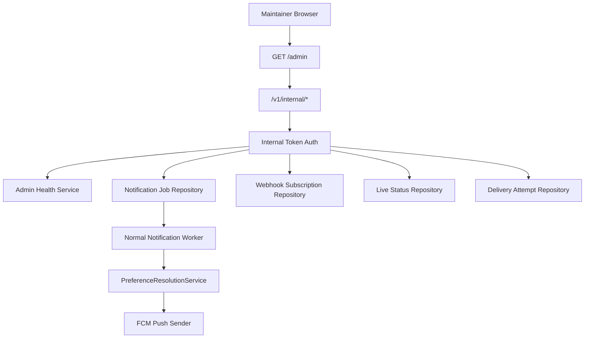

# OCI Server Admin Console Design

## Goal

Build a lightweight server management console for the OCI-hosted Stellive Notification Hub backend. The console helps a maintainer inspect API health, adapter status, database-backed notification jobs, WebSub subscriptions, live status cache, delivery diagnostics, and environment readiness without bypassing the project's notification, platform API, asset, or secrets policies.

## Context

The current backend lives in `backend/stellive-hub-api` and uses TypeScript, Fastify, Prisma, PostgreSQL, Zod, Firebase Admin SDK, and Vitest. The backend is the policy-critical control plane: it mediates protected platform API access, event ingestion, dedupe, preference enforcement, database-backed notification jobs, and push fan-out.

The project also has an OCI constraint: the existing OCI instance may already run other workloads, including a Minecraft server. The console must therefore remain lightweight and should not add a separate always-on web application, heavy worker, Redis dependency, or broad public management surface for the MVP.

## Non-Goals

- Do not build a separate Next.js, Vite, or SPA deployment for the MVP console.
- Do not add manual push notification sending.
- Do not let console actions bypass `PreferenceResolutionService`, quiet hours, keyword rules, rate limits, load reduction, or unsupported-event guards.
- Do not expose API secrets, OAuth tokens, Firebase credentials, production device tokens, raw private platform responses, profile images, logos, fan art, captured images, or copied media.
- Do not add unauthenticated admin writes.
- Do not add unauthorized crawling, login-cookie scraping, private Cafe collection, or platform access bypasses.
- Do not create or manage Former member catalog entries.

## Recommended Approach

Use the existing Fastify backend as the console host:

- Serve a small server-rendered HTML console at `/admin` only when `ADMIN_CONSOLE_ENABLED=true`.
- Expose JSON management APIs under `/v1/internal/*`.
- Protect both the HTML console and internal APIs with token-based internal authentication.
- Keep the UI dependency-free: plain HTML, CSS, and a small inline script that calls internal JSON endpoints.
- Keep all operational mutations narrow and auditable: scheduler trigger, notification job drain, WebSub renewal trigger, and diagnostic reads.

This approach fits the existing backend, keeps OCI load low, and avoids another deployment unit.

## Alternatives Considered

### Embedded Fastify Console

This is the selected approach. It has one process, one Docker image, one authentication boundary, minimal memory use, and direct access to backend services already needed for diagnostics. The tradeoff is that the UI should remain utilitarian rather than becoming a full admin product.

### Separate Frontend App

A separate frontend would provide more UI flexibility, but it adds a second build pipeline, another deployment surface, cross-origin configuration, and more security handling. That cost is not justified for the MVP.

### CLI-Only Management

A CLI is very light and safe, but it is less useful for scanning job status, adapter health, environment readiness, and recent delivery diagnostics. CLI scripts can still be added later for server automation, but they should call the same internal APIs rather than introducing separate behavior.

## Security Model

### Availability

The console is disabled by default:

```env
ADMIN_CONSOLE_ENABLED=false
```

When disabled:

- `GET /admin` returns 404.
- `/admin/*` static or helper routes return 404.
- `/v1/internal/*` can remain available only if internal API auth is configured, because those endpoints are also intended for schedulers and workers.

### Authentication

Use bearer token authentication for all internal management surfaces:

```env
INTERNAL_API_TOKEN=replace_with_internal_api_token
ADMIN_CONSOLE_TOKEN=replace_with_admin_console_token
```

Rules:

- `/v1/internal/*` accepts only `Authorization: Bearer <INTERNAL_API_TOKEN>`.
- `/admin` accepts `Authorization: Bearer <ADMIN_CONSOLE_TOKEN>`.
- For simple browser usage, `/admin/login` may set an `HttpOnly`, `SameSite=Strict` session cookie after validating the admin token.
- If `ADMIN_CONSOLE_TOKEN` is not set, the admin console must not start, even when `ADMIN_CONSOLE_ENABLED=true`.
- The implementation must not log received tokens.

For OCI operation, the preferred access path is SSH tunneling or private network access. Public internet exposure should require both HTTPS termination and the admin token.

### Authorization

The MVP has one maintainer role. It allows:

- Read operational status.
- Trigger approved scheduler actions.
- Trigger notification job drain.
- View recent diagnostics.

It does not allow:

- Editing user preferences.
- Editing device tokens.
- Editing member catalog entries.
- Creating manual push notifications.
- Uploading assets.
- Viewing raw secrets.

## Console Pages

### Overview

Shows compact health cards:

- API process status.
- Database readiness.
- Console enabled state.
- Queue summary by status.
- Adapter health summary.
- Recent delivery attempts by status.
- Feature flag snapshot.

Feature flags are displayed as booleans or statuses. Secret-bearing variables are displayed only as `configured` or `missing`.

### Adapter Health

Shows each adapter:

- `youtube`
- `chzzk`
- `x`
- `naver_cafe`

Each adapter reports:

- `status`: `enabled`, `disabled`, `verify_required`, or `rate_limited`.
- `reason`.
- `lastCheckedAt`.
- `nextRecommendedCheckAt` when known.
- `sourceVerificationState` when relevant.

X must report `disabled` with a reason such as `x_no_free_official_api` unless a no-cost official API path is explicitly enabled by environment flags.

### Notification Jobs

Shows database-backed `NotificationJob` information:

- Counts by `queued`, `locked`, `completed`, and `failed`.
- Oldest queued job timestamp.
- Recent failed jobs with `lastError`.
- Manual drain action that calls `/v1/internal/jobs/notifications/drain`.

The drain action must still use the normal worker path. It must not directly send pushes or bypass preference resolution.

### WebSub

Shows `WebhookSubscription` rows for YouTube:

- Target channel or catalog item id.
- Topic URL.
- Status.
- Lease expiration.
- Last verification time.
- Last error.

Provides a renew action that calls `/v1/internal/schedulers/youtube/renew-subscriptions`.

### Live Status

Shows `LiveStatus` cache:

- Member id.
- Generation/category id.
- Live state.
- Title when available from allowed APIs.
- Started time when provided by an allowed official API.
- Last checked time.
- Source verification state.

Provides a CHZZK polling trigger only when `CHZZK_LIVE_POLLING_ENABLED=true`. If the production-allowed API method is still unverified, the trigger returns `verify_required` and produces no events.

### Delivery Diagnostics

Shows recent `DeliveryAttempt` rows:

- Event id.
- Device id redacted or omitted.
- Status.
- Reason.
- Event type.
- Delivery level.
- Push priority.
- Provider error code when present.
- Attempt time.

The console should never show full production device tokens.

### Environment Readiness

Shows required and optional configuration readiness:

- `DATABASE_URL`: configured or missing.
- `INTERNAL_API_TOKEN`: configured or missing.
- `ADMIN_CONSOLE_TOKEN`: configured or missing.
- Firebase variables: configured or missing.
- YouTube variables: configured or missing.
- X variables and no-paid policy flags.
- CHZZK variables and polling flag.
- Naver variables and search flag.

The actual values are never returned to the browser.

## Internal API Design

### `GET /v1/internal/admin/overview`

Returns:

- `service`: service name, version, uptime seconds, environment.
- `database`: readiness status.
- `featureFlags`: safe booleans and policy flags.
- `secrets`: configured or missing only.
- `queue`: job counts and oldest queued timestamp.
- `adapters`: compact adapter health.
- `recentDelivery`: count summary.

### `GET /v1/internal/adapters/health`

Returns full adapter health. This endpoint already exists in the API implementation plan and should be implemented as the single source for console adapter status.

### `GET /v1/internal/jobs/notifications`

Returns paginated notification job diagnostics. Default limit is small to keep the console lightweight.

### `POST /v1/internal/jobs/notifications/drain`

Triggers the database-backed notification worker for a bounded batch.

Request:

```json
{
  "limit": 25
}
```

Response:

```json
{
  "claimed": 0,
  "completed": 0,
  "failed": 0,
  "skipped": 0
}
```

The MVP can return a controlled `not_implemented` result until the worker exists, but the route shape should be stable.

### `GET /v1/internal/webhooks/subscriptions`

Returns WebSub subscription diagnostics from `WebhookSubscription`.

### `POST /v1/internal/schedulers/youtube/renew-subscriptions`

Triggers YouTube WebSub renewal logic. It must use existing feature flags and configured callback settings.

### `POST /v1/internal/schedulers/chzzk/live-status`

Triggers safe CHZZK live status polling. If the official allowed API path is not confirmed or not enabled, it returns `verify_required` or `disabled` and creates no events.

### `GET /v1/internal/live-status`

Returns the current database-backed live status cache for diagnostics.

### `GET /v1/internal/delivery-attempts`

Returns recent technical delivery attempt diagnostics with sensitive fields omitted.

## Data Flow



The key boundary is that console actions invoke normal backend services. They do not create side paths around notification policy.

## File Structure

```text
backend/stellive-hub-api/src/
  admin/
    adminAuth.ts
    adminConsoleHtml.ts
    adminHealthService.ts
    adminTypes.ts
  routes/
    adminRoutes.ts
    internalRoutes.ts
    routes.ts
  repositories/
    deliveryAttemptRepository.ts
    liveStatusRepository.ts
    notificationJobRepository.ts
    platformApiStateRepository.ts
    webhookSubscriptionRepository.ts
```

Existing files to modify:

- `backend/stellive-hub-api/src/app.ts`
- `backend/stellive-hub-api/src/config/env.ts`
- `backend/stellive-hub-api/.env.example`
- `shared/openapi/openapi.yaml`
- `docs/API_SETUP.md`
- `docs/ARCHITECTURE.md`

## UI Design

The UI should be utilitarian and dense:

- No marketing hero.
- No proprietary brand styling.
- No official logos or member images.
- No copied platform visual language.
- Use compact tables, status pills, and text buttons.
- Keep cards limited to individual status groups.
- Keep content readable on mobile, but optimize for desktop maintainer usage.

The first screen should be the operational dashboard, not an intro page.

## Error Handling

- Missing admin token returns 503 from `/admin` when enabled but misconfigured.
- Invalid or missing bearer token returns 401.
- Disabled console returns 404.
- Database failures return a redacted error status and log the detailed server-side error.
- Scheduler triggers return `disabled`, `verify_required`, or `queued` rather than throwing for expected platform-disabled states.
- All internal responses use stable `status` and `reason` strings suitable for display.

## Testing Strategy

Add Vitest coverage for:

- Admin console is disabled by default.
- Enabled console requires `ADMIN_CONSOLE_TOKEN`.
- Internal routes reject missing or invalid bearer tokens.
- Overview redacts secret values.
- Adapter health reports X disabled by default under `no_paid_api`.
- Job drain route calls a bounded worker interface and does not send directly.
- CHZZK live status trigger returns disabled or verification-required when not enabled.
- Delivery attempts omit raw device tokens.

## Deployment Notes For OCI

Recommended deployment shape:

- One backend process in the existing Docker image.
- Admin console disabled unless actively needed.
- Access through SSH tunnel or private network when possible.
- Keep database-backed jobs bounded by small limits.
- Avoid adding Redis/BullMQ as a console requirement.
- Keep `docker-compose.yml` useful for local development and optional self-hosting.

Required environment variables for console use:

```env
ADMIN_CONSOLE_ENABLED=true
ADMIN_CONSOLE_TOKEN=replace_with_admin_console_token
INTERNAL_API_TOKEN=replace_with_internal_api_token
```

## Policy Checklist

- Former members are not introduced.
- Gangzi remains only in `gamja` and is not treated as a generation member.
- Official channel remains under `official` / `기타`.
- Official YouTube live notifications remain unsupported and excluded before storage.
- Console-triggered job drains use normal preference resolution and load reduction.
- `realtime_best_effort` remains best effort and never bypasses user settings.
- `chzzk_chat` remains off by default and is not exposed as a push action.
- No secrets, production tokens, logos, profile images, fan art, screenshots, or copied media are exposed or committed.
- X remains disabled unless no-cost official API access is explicitly enabled.
- Naver Cafe automatic collection remains deferred unless a clearly allowed official path is enabled.

## Open Decisions Closed For MVP

- The MVP console is embedded in Fastify.
- The MVP UI is dependency-free server-rendered HTML with small browser-side fetch calls.
- The MVP admin role is a single maintainer role.
- The MVP has diagnostics and controlled triggers only, not catalog editing or manual push creation.
- The MVP targets OCI low-load operation and keeps scheduler/job actions bounded.
